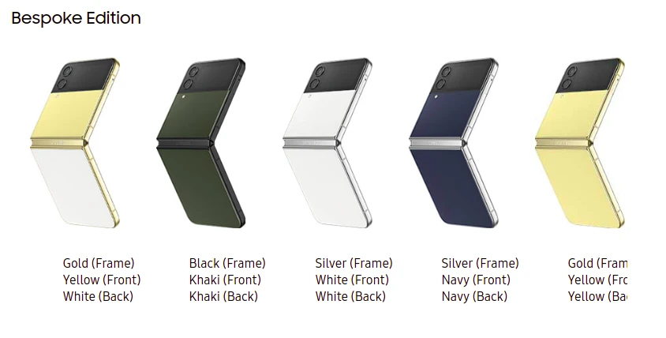
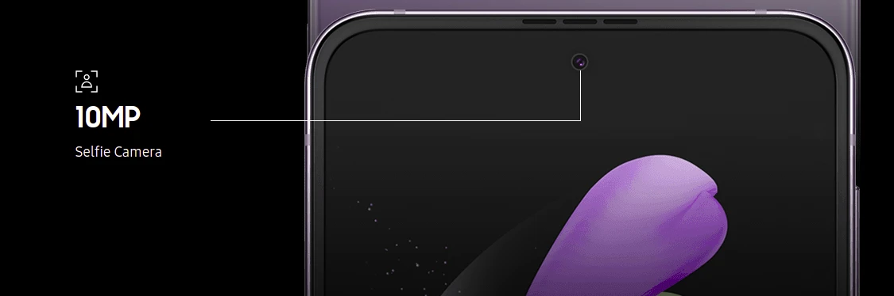
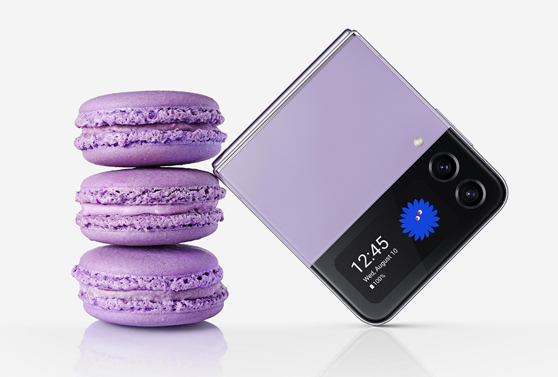

#### How much will it cost?

Anything around $999 to $1100

#### What are the Galaxy Z flip4 and release date?

The official release date is on the 2nd of September 2022 but it is available to those who want to use the product before.

#### Why choose the Galaxy Z flip4?

Here is what makes the galaxy flip/fold 4 phones from the future…

* It’s  small,  enough to fit your pockets 

Dimensions

Folded: 71.9 x 84.9 x 17.1mm, (Hinge) - 15.9mm (Sagging) Unfolded: 71.9 x 165.2 x 6.9mm 144HZ refresh rate ).

* Epic design is foldable and has two screens so that you can view notifications on the cover screen if you don't want to spend an extra ($374.99) for the galaxy watch 4. 

Cover Screen 1.9" Super AMOLED Display 512 x 260 302 pp this also allows you to unleash the power of the dual camera setup as you can capture “selfies” and pre-view them without un flipping the device

Also allows the people being snapped to view the image from behind which is really cool.

* Intelligent features, you don't come across these features daily      Scene Optimizer- to make your photos stand out, Shot suggestions, and scan QR codes seamlessly.                                What colors are available, Galaxy 4 colors;

  ### For basic colors

  **Bora Purple, Graphite, Pink Gold, Blue**

  

  made for a particular customer or user (bespoke edition) - only available in certain countries on [samsung.com](http://samsung.com)

  

  * Gold (Frame) Yellow (Front) White (Back)
  * Black (Frame) Khaki (Front) Khaki (Back)
  * Silver (Frame) White (Front) White (Back)
  * Silver (Frame) Navy (Front) Navy (Back)
  * Gold (Frame) Yellow (Front) Yellow (Back

  #### Front Camera

  

  10MP Punch hole Selfie Camera

  Pixel size: 1.22μm

  FOV: 80˚

  F.No (aperture): F2.4

  #### Rear Camera (Dual camera setup) This is where the intelligent features kick in.

  #### 12MP Ultra Wide Camera, 

  Pixel size: 1.12μm,FOV: 123˚,F.No (aperture): F2.2

  #### 12MP Wide-angle Camera,

Dual Pixel AF, OIS,Pixel size: 1.8μm,FOV: 83˚,F.No (aperture): F1.8

* OIS (Optical Image Stabilization) for Wide-angle Camera

  *
  * Super clear glass with Corning® Gorilla® Glass with DX for Wide-angle Camera
  * Up to 10x digital zoom

  What you will get in the box

   Galaxy Z Flip4

         The device, Data Cable, Ejection Pin, Quick Start Guide

  ### Galaxy Z flip4 Summary.

  

The Galaxy flip4 is not dustproof and only water-resistant at the max height of 1.5 meters and not beach/swimming pool recommended which is too bad but at least you can grab your flip4 from your bathtub or sink in case it slips as a result of the sleek design.

This is a blow to the scuba divers and swimming YouTubers so I guess you’ll have to hold on to your iPhone 13 pro max which has a rating of “IP68” which means they are fully protected from dust and can handle being underwater for up to 30 minutes at a depth of 6 meters w-a-a-a-y enough to get the job done.

 It comes with Virus and malware protection powered by McAfee and a secure folder or in my words (vault) to keep your credentials and any other stuff you want to throw in safe.

Of course, it comes with a OneUI 4.1 based on Android 12

The fingerprint sensor comes built into the power button which also allows you to scroll the screen or slide down the notifications

The Z flip4 battery is quite larger at 3,700 mAh 25W and 15W/ Fast charge and 4.5W Reverse Fast charging compared to Z flip3 3300mAH 15W  and 10W reverse charging.

Other features are support of E-sim and has a pre-installed screen protector

Flex your life!